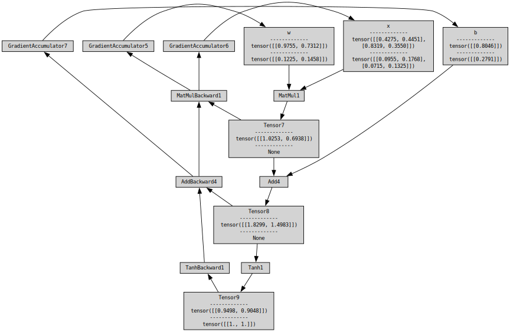

# autograd
Autograd similar to Pytorch's. Much more simple of course.  
Built for educational purposes, while learning about backpropagation, watching Andrej Karapthy's micrograd videos and being curios about how all of this was implemented in Pytorch.
  
It constructs a computational graph based on the operations performed on Tensor objects. Tensor objects hold a matrix as data, which are torch.Tensors. Each operation (function) applied on one or more tensors constructs a BackwardFunction object, which is part of the backpropagation path of the computational graph. It propagates the gradients back to an Accumulator, that sets the Tensor's grad variable.  
Every class in the computational graph is a subclass of Node, which is then used to create a visual represenation of the graph, using Graphviz.  

## TODO:
- Implement more functions
- Implement a neural net with the Tensor objects.

## Bibliography
[A Gentle Introduction to torch.autograd](https://docs.pytorch.org/tutorials/beginner/blitz/autograd_tutorial.html)  
[Computational graphs constructed in Pytorch](https://pytorch.org/blog/computational-graphs-constructed-in-pytorch/)  
[PyTorch Autograd Explained - In-depth Tutorial](https://www.youtube.com/watch?v=MswxJw-8PvE)  

